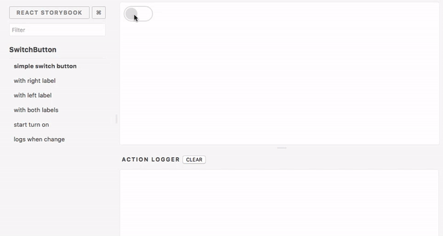

# Learning React: TDD + BDD

We'll use *Storybook, Enzyme and Lyef* React Component.

## How to install
- npm install
- npm install --only=dev
- npm run build
- npm run storybook
- npm start
- npm run test

### chai-enzyme
- npm install --save-dev chai-enzyme

## Creating your Component

### Writing your code

Write your component code on `src/Main.js`, you can create another files for composable components also.

```js
import React from 'react';
import PropTypes from 'prop-types';

const Component = ({ name }) => (
    <h1>Hello {name}!</h1>
);

Component.propTypes = {
    name: PropTypes.string.isRequired,
};

export default Component;
```

### Writing Stories



Stories are like behavior or states that our components should have. Such as an activated button, labels, whatever your component can change by props/states.

You can also see them as user stories for the agile development.

To understand more about that, I suggest you to read the [storybook stories guide](https://storybook.js.org/basics/guide-react/). Follow the example above:

```js
storiesOf('Component', module)
    .add('with lyef name', () => (
        <Component name="lyef" />
    ))
    .add('with another name', () => (
        <Component name="another" />
    ))
```

Every new story will be available on the left side panel of React Storybook to see different cases.
